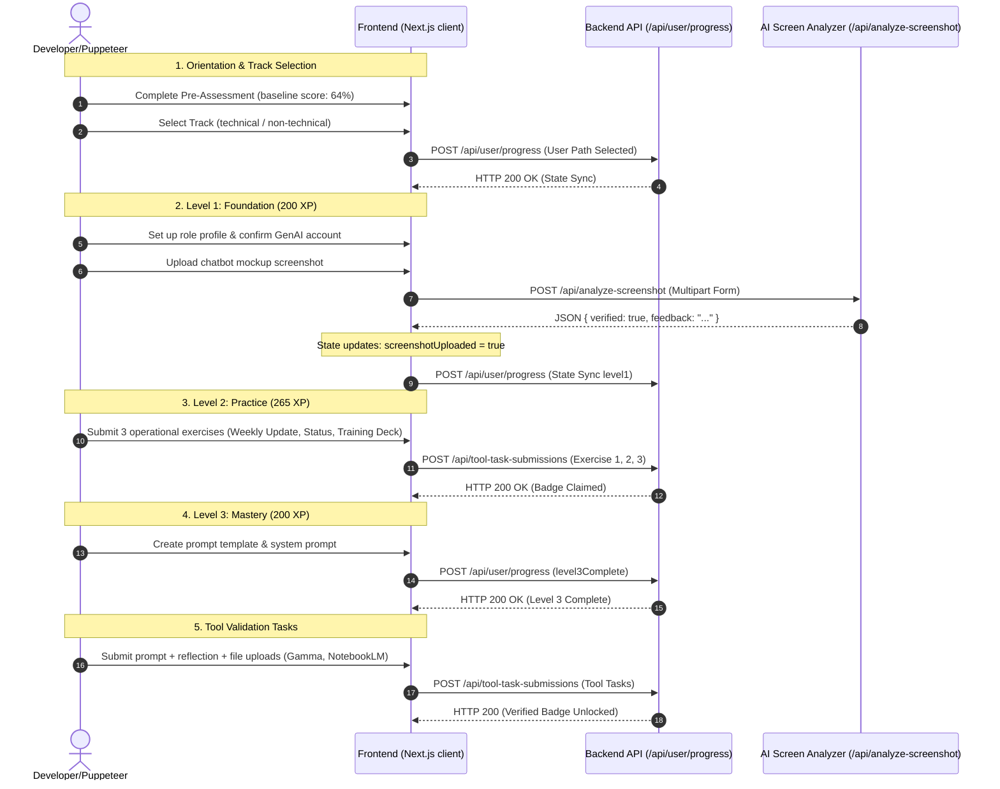

# Next.js AI Productivity Training Site — Complete Automation & Troubleshooting Guide

This guide details the complete roadmap for automating, testing, and debugging all levels on the training site (`https://aiskills.nation.dev/`). It includes full sequence flowcharts, technical field mappings, local debugging setups, and session management guidelines.

---

## 🗺️ Completion Roadmap & Architecture

This flowchart outlines the progression of levels and the backend synchronization flows.



---

## 📋 Technical Form Field Cheat Sheet

When automating submissions or manually testing input validation, refer to the selector IDs and format constraints below.

| Field Selector ID | Input Type | Required | Constraint / Validation Rules | Purpose / Expected Value |
| :--- | :--- | :---: | :--- | :--- |
| **`#promptUsed`** | `<textarea>` | Yes | Min length: 10 chars | The exact system or user prompt used in the AI tool. |
| **`#aiResponse`** | `<textarea>` | Yes | Min length: 20 chars | The raw output, slides, outline, or summaries returned by the tool. |
| **`#reflection`** | `<textarea>` | Yes | Min length: 15 chars | Reflection on what was reviewed, verified, or changed. |
| **`#humanEdits`** | `<textarea>` | Yes | Required only if `criteria.edits` is true | Description of human modifications made to the AI draft. |
| **`#timeSavings`** | `<select>` | No | Must match option values | Value options: `much-longer`, `about-same`, `somewhat-less`, `significantly-less`, `fraction`. |
| **`#artifact`** | `<input type="file">` | Yes | MIME limits (see below) | Uploaded output evidence file. |

### 📁 File Upload Mime-Type Mappings

> [!IMPORTANT]
> If a file upload violates these MIME limits, the form submit action will fail silently, and the button will remain clickable but non-responsive.

* **Gamma Task** (`/skills/gamma/tasks/gamma-leadership-update-deck`):
  * **Accepted**: `application/pdf`, `application/vnd.openxmlformats-officedocument.presentationml.presentation` (`.pptx`).
  * **Rejected**: Images, plain text (`.png`, `.jpg`, `.txt`).
* **NotebookLM Task** (`/skills/notebooklm/tasks/notebooklm-source-briefing`):
  * **Accepted**: `application/pdf`, `image/png`, `image/jpeg`, `image/webp`, `text/plain`, `text/markdown`.
  * **Rejected**: Microsoft PowerPoint/Word files (`.pptx`, `.docx`).

---

## 💻 Running the Automation Scripts

To execute or reproduce the completion steps, follow the setup instructions below.

### Setup Requirements
1. Install Node.js (v18+ recommended).
2. Install dependencies:
   ```bash
   npm install puppeteer
   ```

### Execution
Run the correct script from the project root directory:
```bash
# To generate the chatbot mockup and submit Level 1:
node scratch/upload_correct_screenshot.js

# To generate a valid PDF and submit Gamma & NotebookLM tasks:
node scratch/generate_pdf_and_submit.js
```

---

## 🔍 Local Debugging & DevTools Inspection

If a step or submission is failing silently:

### 1. Enable Non-Headless Mode
Modify the Puppeteer launcher in your script to open a visible Chromium browser window:
```javascript
const browser = await puppeteer.launch({
  headless: false, // Opens visible browser
  devtools: true,   // Automatically opens DevTools panel
  slowMo: 100,      // Slows down actions by 100ms so you can observe the UI
  args: ['--no-sandbox', '--disable-setuid-sandbox']
});
```

### 2. Capture Browser Logs & JS Errors
Ensure you attach listeners to capture browser console warnings and scripts errors:
```javascript
page.on('console', msg => console.log('BROWSER CONSOLE:', msg.text()));
page.on('pageerror', err => console.log('BROWSER EXCEPTION:', err.toString()));
```

---

## 🔑 Session & Cookie Management

The training site uses a session token to authenticate requests. If the scripts fail with authentication redirects, your cookies have likely expired.

### How to Refresh Cookies
1. Log in to `https://aiskills.nation.dev` manually on your desktop browser.
2. Open Chrome Developer Tools (**F12** or **Ctrl+Shift+I**).
3. Go to the **Application** tab -> **Storage** -> **Cookies** -> `https://aiskills.nation.dev`.
4. Copy the cookies (especially the session token).
5. Format and save them as an array inside [cookies.json](file:///c:/Users/toms/Documents/antigravity-awesome-skills-main/scratch/cookies.json):
   ```json
   [
     {
       "name": "next-auth.session-token",
       "value": "YOUR_NEW_TOKEN_VALUE_HERE",
       "domain": "aiskills.nation.dev",
       "path": "/",
       "secure": true,
       "httpOnly": true
     }
   ]
   ```
