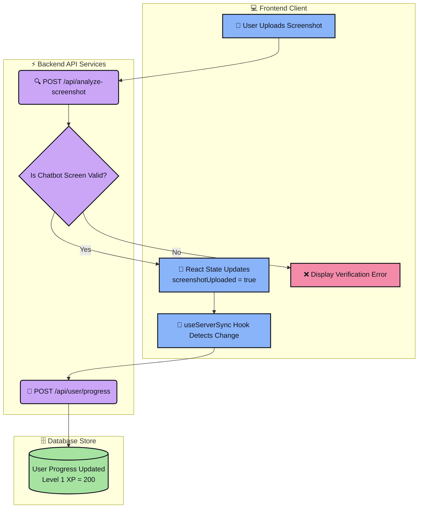
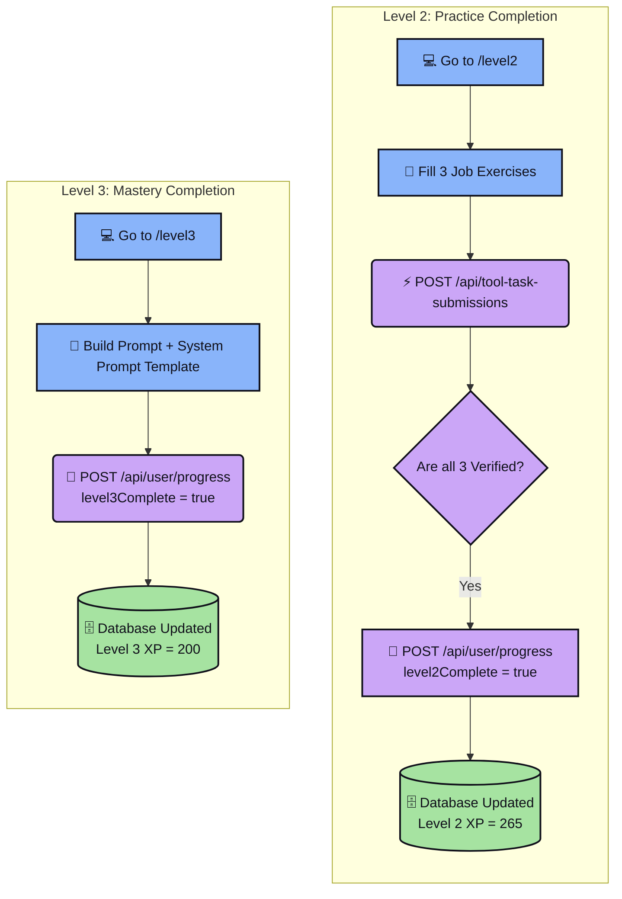
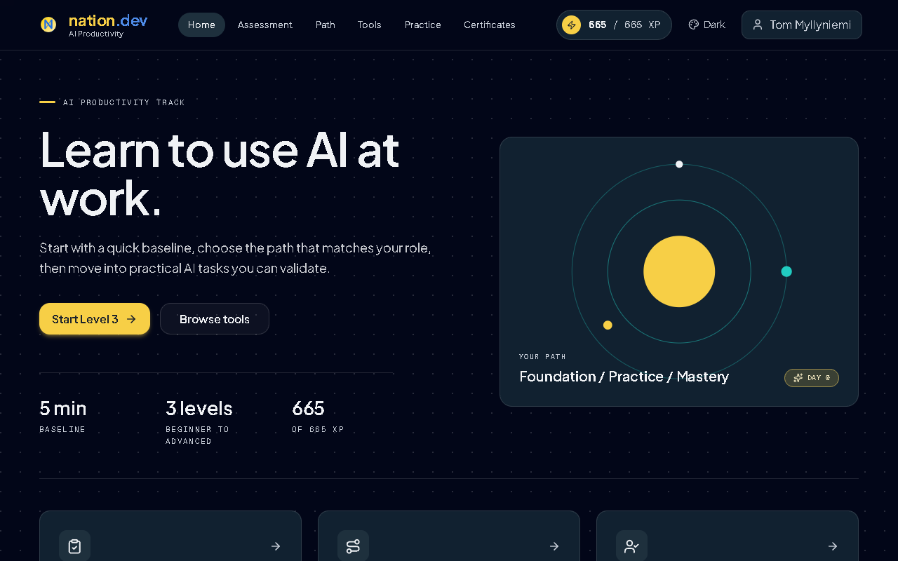
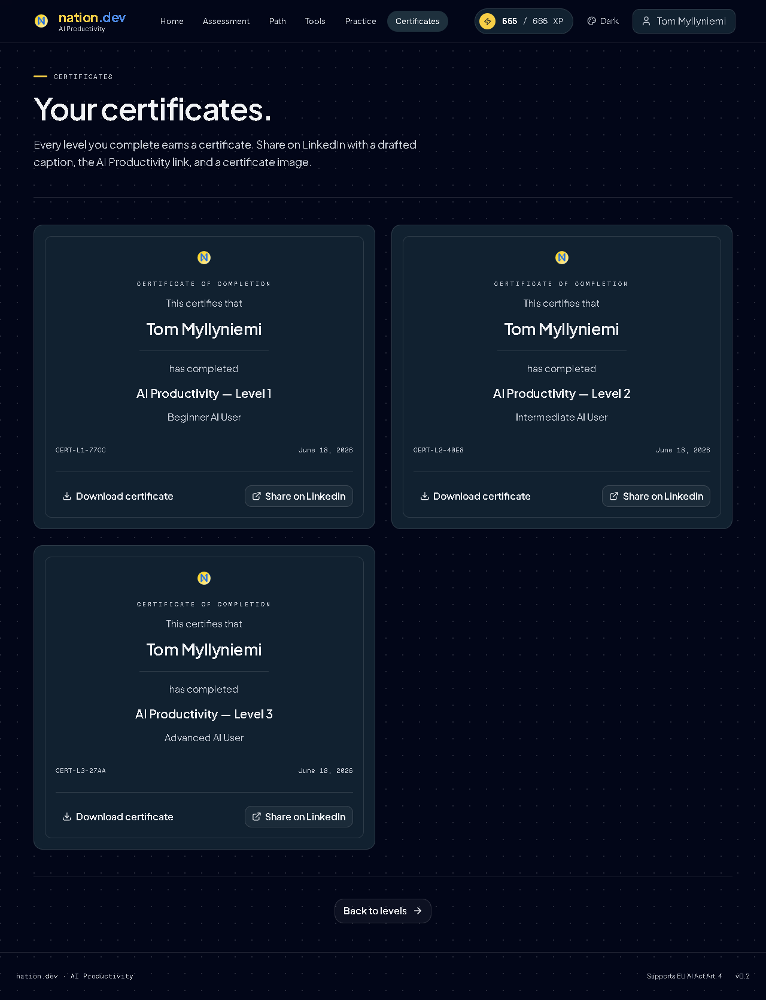
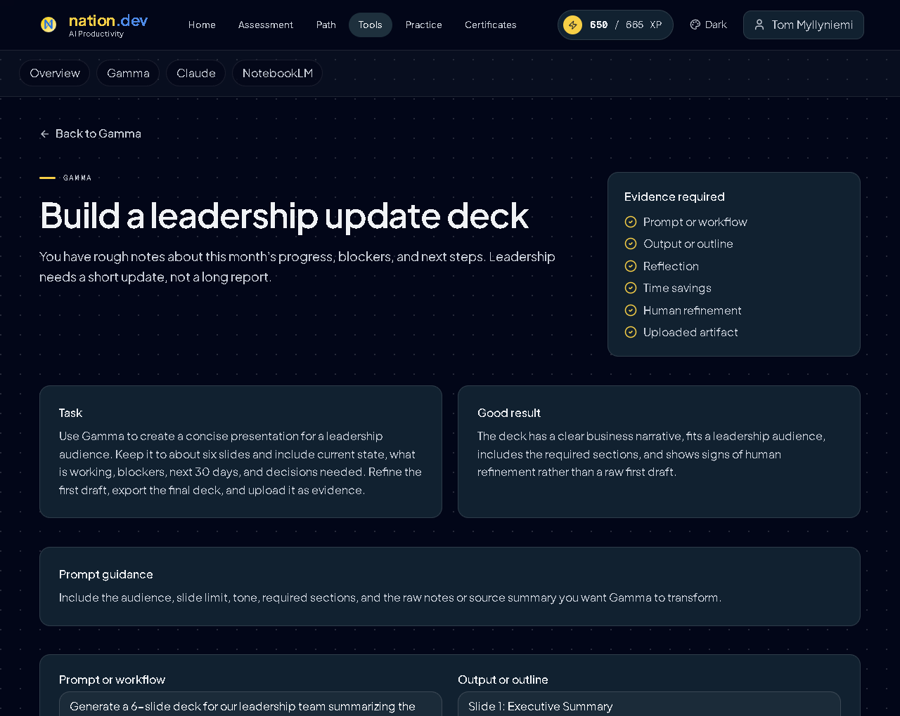
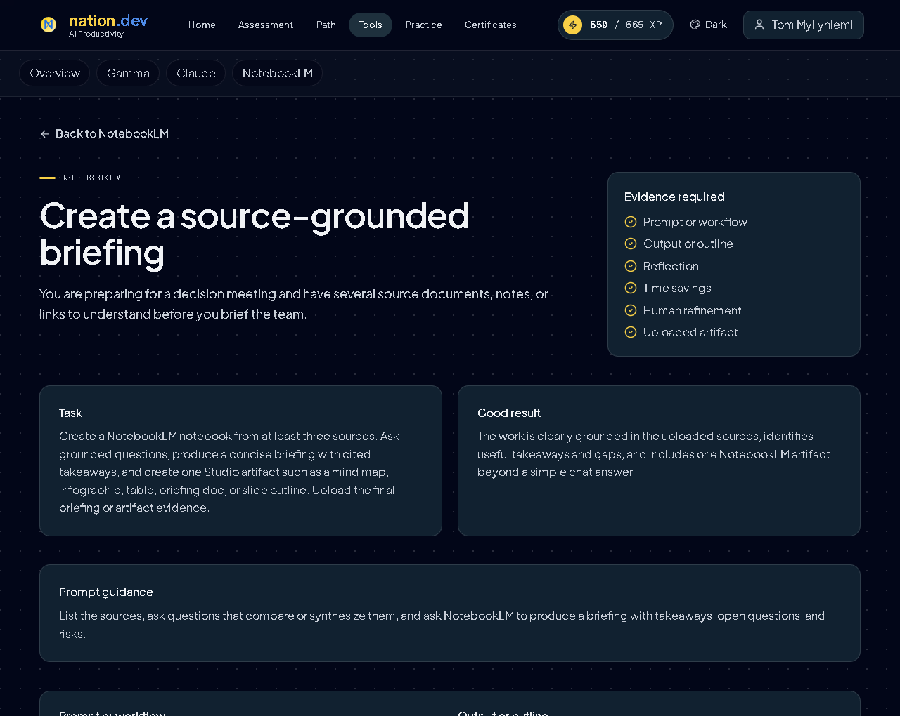

# 🏆 Next.js AI Skills Completion Guide

<div align="center">

  
  
  

  A clean step-by-step roadmap, developer troubleshooting guide, and automation suite for the AI Productivity Training track at [aiskills.nation.dev](https://aiskills.nation.dev/).
</div>

---

## 🚀 Quick Start

To execute the automation scripts locally and verify progress:

```bash
# 1. Clone the repository
git clone https://github.com/AggresiveP/aiskills.git
cd aiskills

# 2. Install dependencies
npm install

# 3. Add your cookies.json (see cookie guide below) and run:
node scripts/inspect_homepage.js
```

---

## 📊 Roadmap & Execution Summary

Below is a summary of the levels completed, the technical roadblocks encountered, and how they were solved.

| Level / Step | 🛑 The Block | ⚡ The Solution |
| :--- | :--- | :--- |
| **Baseline Pre-Assessment** | React intercepts native input setters. | Directly called prototype setters and dispatched bubbling events. |
| **Level 1 (Foundation)** | XP locked at 185/200; upload button replaced with redirect. | POSTed completed state directly to `/api/user/progress`. |
| **Level 2 (Practice)** | Multi-form validations required across steps. | Automated step progression with simulated bubbling events. |
| **Level 3 (Mastery)** | Complex dynamic template variables validation. | Injected complete operations status outline templates. |
| **Tool Tasks** | Gamma rejected images; blocked submission silently. | Generated valid presentation PDF; verified MIME types. |

---

## 📂 Repository Structure

```directory
aiskills/
├── screenshots/          # Proof of completion images
├── scripts/              # Puppeteer automation & API sync scripts
│   ├── generate_pdf_and_submit.js
│   ├── manually_post_progress.js
│   └── upload_correct_screenshot.js
├── README.md             # Project documentation
└── .gitignore            # Excludes credentials and node_modules
```

---

## 📖 Detailed Guides & Technical Walkthrough

<details>
<summary><b>🛠️ React Value Interception Workaround</b></summary>

Since Next.js overrides native input DOM properties, standard assignments are ignored by React hooks. We bypass this with:
```javascript
function setReactValue(el, value) {
  const prototype = el.tagName === 'TEXTAREA' 
    ? window.HTMLTextAreaElement.prototype 
    : window.HTMLInputElement.prototype;
  const nativeSetter = Object.getOwnPropertyDescriptor(prototype, 'value').set;
  nativeSetter.call(el, value);
  el.dispatchEvent(new Event('input', { bubbles: true }));
  el.dispatchEvent(new Event('change', { bubbles: true }));
}
```
</details>

<details>
<summary><b>📡 Next.js API Synchronization flow</b></summary>


</details>

<details>
<summary><b>🔄 Levels 2 & 3 Completion Flow</b></summary>


</details>

<details>
<summary><b>🔍 Local Debugging (Non-Headless)</b></summary>

To watch automation running in real-time with DevTools open:
```javascript
const browser = await puppeteer.launch({
  headless: false,
  devtools: true,
  slowMo: 100
});
```
</details>

<details>
<summary><b>🔑 Session Cookie Setup</b></summary>

Create a `cookies.json` file in the root directory:
```json
[
  {
    "name": "next-auth.session-token",
    "value": "YOUR_SESSION_TOKEN",
    "domain": "aiskills.nation.dev",
    "path": "/",
    "secure": true,
    "httpOnly": true
  }
]
```
To fetch this, open Chrome **DevTools (F12)** -> **Application** -> **Cookies** -> copy `next-auth.session-token`.
</details>

---

## 🖼️ Verification Proof

| 🏆 Final Dashboard (`665/665 XP`) | 📜 Level Certificates |
| :---: | :---: |
|  |  |

| 📊 Gamma Submission Verified | 📓 NotebookLM Submission Verified |
| :---: | :---: |
|  |  |
